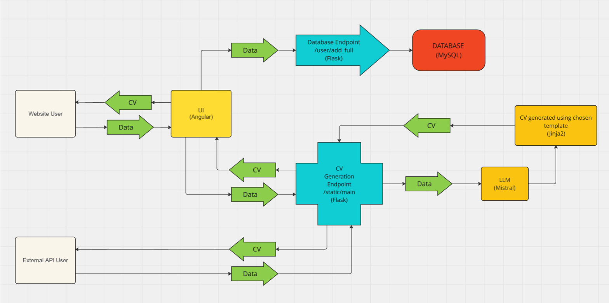

# AI-Based CV Builder

This project explores the development of an AI-powered CV builder to streamline the resume creation process. It leverages the power of large language models (LLMs) to analyze user input and craft compelling and targeted CVs.

## Tech Stack

- **Frontend**: Angular
- **Backend**: Flask
- **Database**: MySQL
- **ORM**: SQLAlchemy
- **AI API**: MistralAI API

## Features

- **AI-Driven CV Generation**: Automatically generate professional CVs using Mistralai's API based on user input.
- **User-Friendly Interface**: Angular-powered frontend for a seamless user experience.
- **Comprehensive Database**: A well-structured MySQL database with SQLAlchemy ORM for managing user data, CV templates, and generated CVs.
- **Customizable CV Templates**: Users can choose from multiple CV templates and customize them according to their preferences.
- **Secure and Scalable**: Built with Flask, ensuring good scalability of the backend services.

## Workflow

### Website User Interaction:
Input Data: The website user inputs their data into the UI
(Angular).

Receive CV: The website user can download or view the
generated CV.

### Data Flow to UI (Angular):
The user-provided data is sent to the UI component built using
Angular. This UI acts as the interface for the user to enter and
view their data.

### Data Submission to Backend:
The data from the UI is forwarded to the Database Endpoint
(/user/add_full), which is a Flask-based service.
This endpoint is responsible for storing the data into a MySQL
database.

### Database Storage:
The Flask endpoint stores the received data in a MySQL
database for persistence.

### CV Generation Endpoint:
The UI (Angular) also sends the user data to the CV Generation
Endpoint (/static/main), which is another Flask-based service.
This endpoint processes the data for CV generation.

### Data Processing and CV Generation:
Data to LLM (Mistral): The user data is sent from the CV
Generation Endpoint to the LLM (Mistral) for processing.
LLM Processing: The LLM processes the data, enriching or
formatting it as needed for the CV.

Data to Jinja2: The processed data is then sent to a Jinja2
template for the final CV generation.

CV Creation: A CV is generated using the chosen Jinja2
template and returned to the CV Generation Endpoint.

### CV Delivery:
The generated CV is sent back to the UI (Angular), where the
website user can download or view it.

### External API User Interaction:
External API users can interact directly with the CV Generation
Endpoint.
They can submit data and receive a CV similarly to how the
website user interacts with the system.



## Installation

### Requirements

- Node.js and npm (for Angular)
- Python 3.8+
- MySQL Server
- MistralAIN API key

### Installing Requirements

1. Install the required Python packages:
   ```bash
   pip install -r requirements.txt
   ```

### Frontend Setup (Angular)

1. Clone the repository:
   ```bash
   git clone https://github.com/Pamdi8888/ai-cv-builder.git
   cd ai-cv-builder/frontend
   ```

2. Install dependencies:
   ```bash
   npm install
   ```

3. Start the Angular development server:
   ```bash
   ng serve
   ```

